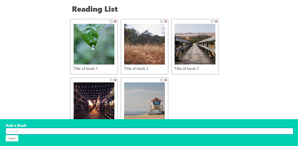

## __1. Sites__
- ### Cheat sheets: `https://state-updates.vercel.app/`
- ### Photos: `https://picsum.photos`

## __2. JSON server__
- ### `$ npm i json-server axios`
- ### Create `/db.json`:
  ```json
  {
    "books": []
  }
  ```
- ### Add to `package.json` scripts:
  ```json
  "server": "json-server -p 3001 --watch db.json --host 127.0.0.1"
  ```

- ### `$ npm run server` and go to `http://localhost:3001/books`

## __3. Add packages__
- ### `$ npm i -D eslint eslint-plugin-react eslint-config-prettier prettier`

## __4. Add scripts to `package.json`__

```json
"lint": "eslint src/**/*.{js,jsx,ts,tsx,json}",
"lint:fix": "eslint --fix src/**/*.{js,jsx,ts,tsx,json}",
"format": "prettier --write src/**/*.{js,jsx,ts,tsx,css,md,json,scss} --config ./.prettierrc"
```

## __5. Add `.eslintrc.json`__

```json
{
    "env": {
        "browser": true,
        "node": true,
        "es2021": true
    },
    "extends": [
        "eslint:recommended",
        "plugin:react/recommended",
        "plugin:react/jsx-runtime",
        "prettier"
    ],
    "parserOptions": {
        "ecmaVersion": "latest",
        "sourceType": "module"
    },
    "settings": {"react": {"version": "detect"}},
    "plugins": [
        "react"
    ],
    "rules": {
        "react/prop-types": "off"
    }
}
```

## __6. Add `.prettierrc`__

```json
{
  "singleQuote": true,
  "trailingComma": "none",
  "tabWidth": 2,
  "semi": false,
  "jsxSingleQuote": true,
  "bracketSpacing": false,
  "bracketSameLine": false,
  "arrowParens": "avoid",
  "proseWrap": "always",
  "singleAttributePerLine": true,
  "printWidth": 120
}
```
